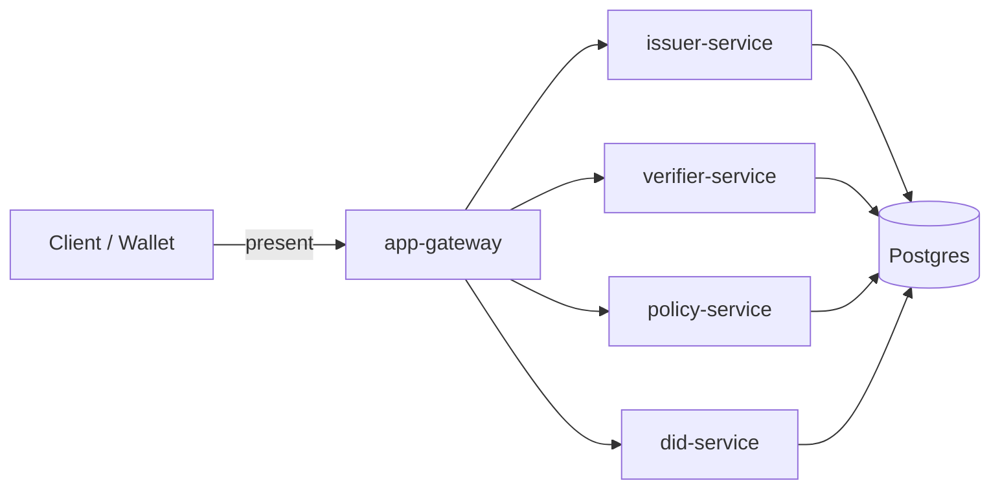
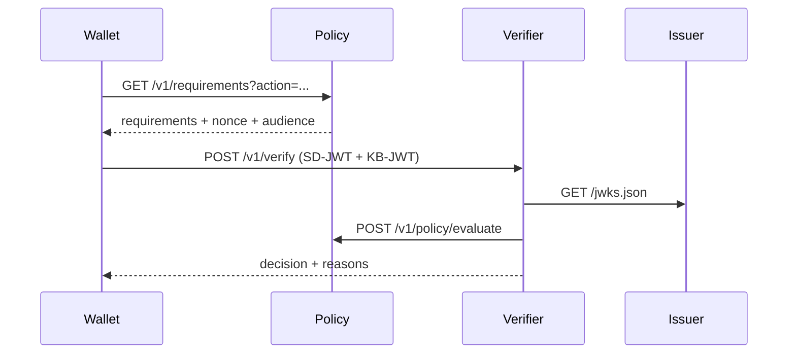
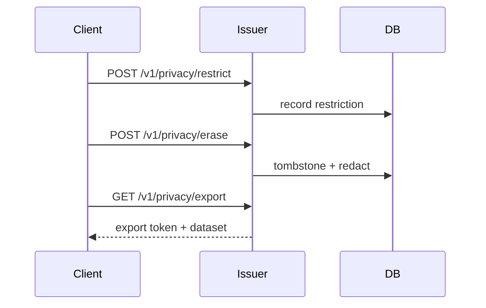

# Architecture

## Service Topology

```mermaid
flowchart LR
  client[Client / Wallet] -->|present| appgw[app-gateway]
  appgw --> did[did-service]
  appgw --> issuer[issuer-service]
  appgw --> verifier[verifier-service]
  appgw --> policy[policy-service]

  issuer --> db[(Postgres)]
  verifier --> db
  policy --> db
  did --> db
```

## Verification Flow

```mermaid
sequenceDiagram
  participant Wallet
  participant Policy
  participant Verifier
  participant Issuer
  Wallet->>Policy: GET /v1/requirements?action=...
  Policy-->>Wallet: requirements + nonce + audience
  Wallet->>Verifier: POST /v1/verify (SD-JWT + KB-JWT)
  Verifier->>Issuer: GET /jwks.json
  Verifier->>Policy: POST /v1/policy/evaluate
  Verifier-->>Wallet: decision + reasons
```

## DSR Flow (Privacy)

```mermaid
sequenceDiagram
  participant Client
  participant Issuer
  participant DB
  Client->>Issuer: POST /v1/privacy/restrict
  Issuer->>DB: record restriction
  Client->>Issuer: POST /v1/privacy/erase
  Issuer->>DB: tombstone + redact
  Client->>Issuer: GET /v1/privacy/export
  Issuer-->>Client: export token + dataset
```
