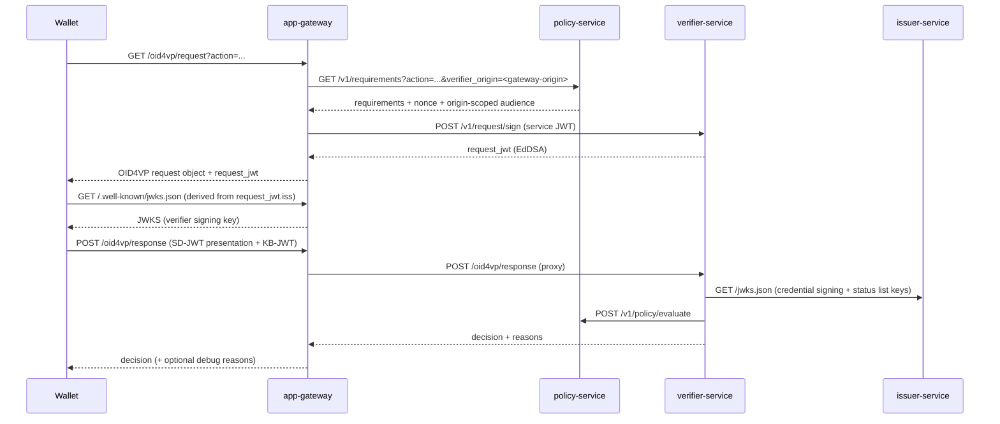
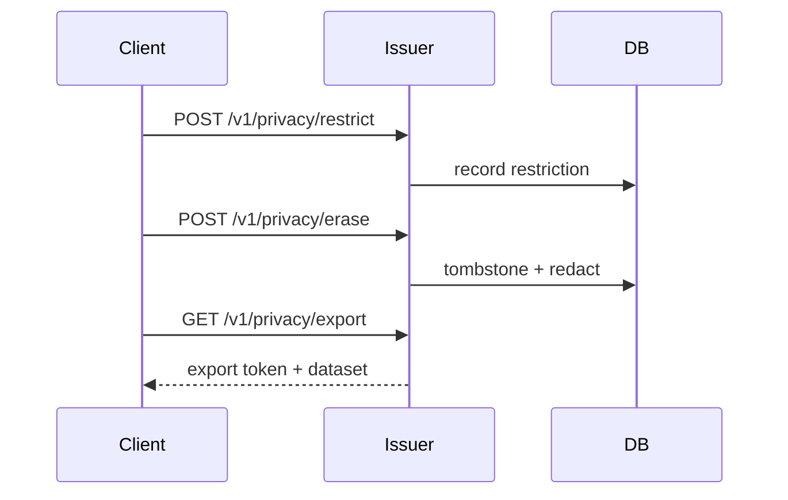

# Architecture

## Service Topology

```mermaid
flowchart LR
  wallet[Wallet / Client] -->|HTTPS (public)| gw[app-gateway]

  gw -->|service JWT (private)| did[did-service]
  gw -->|service JWT (private)| issuer[issuer-service]
  gw -->|service JWT (private)| verifier[verifier-service]
  gw -->|service JWT (private)| policy[policy-service]

  did --> db[(Postgres)]
  issuer --> db
  verifier --> db
  policy --> db

  did -->|Hiero DID registrar/resolver| hedera[(Hedera HCS)]
  issuer -->|Anchors / audit / receipts| hedera
  did --> mirror[Hedera Mirror Node]
  issuer --> mirror
```

## Verification Flow



## DSR Flow (Privacy)


